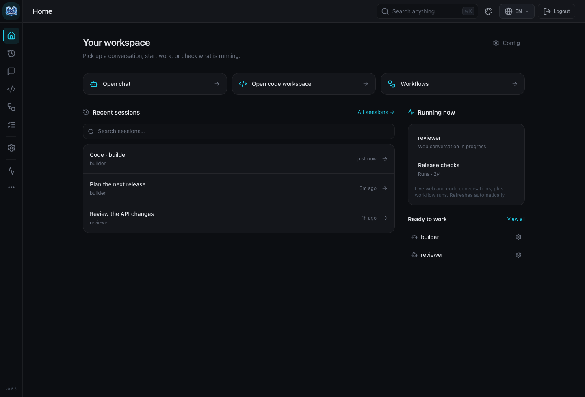
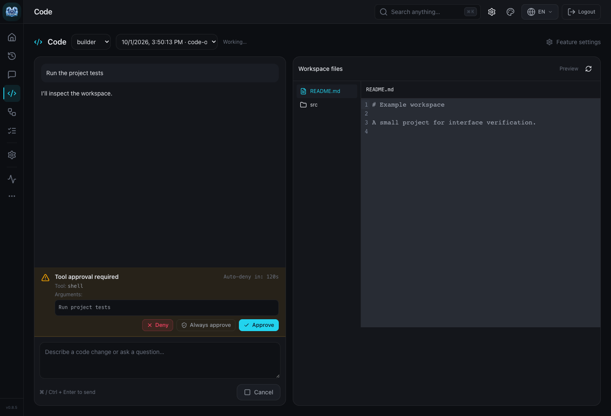

# Building the web dashboard

The web dashboard at `web/` is a Vite + React + TypeScript app. Its TypeScript API client is generated from the gateway's runtime OpenAPI spec, not hand-written.

## Quickstart

<div class="os-tabs-src">

#### sh

```sh
cargo web build         # production bundle into web/dist/
cargo web dev           # vite dev server with HMR
cargo web check         # typecheck only (gen-api + tsc -b)
cargo web gen-api       # regenerate web/src/lib/api-generated.ts
cargo web install       # npm install in web/
```

</div>

`cargo web` is an alias for `cargo run -p xtask --bin web --` (defined in the cargo config). Every subcommand auto-runs `npm install` if `web/node_modules/` is missing.

## Workspace navigation

The home page (`/`) shows recent sessions, current web/code tasks and workflow
runs, and actions supported by the connected daemon. Availability comes from
`GET /api/workspace`, which resolves configured agents with the setup readiness
checks and probes the local RPC listener. An unavailable service does not hide
history from other services. Operational metrics and channel, memory, cost, and
health tabs live at `/system`; existing `/?tab=...` bookmarks still work.



The daily navigation rail links Home, Sessions, Agents, Code, Workflows, and
Runs. All features remain in the expanded menu and command palette. Use
**Cmd+K / Ctrl+K** to search features, session names, agent aliases, and settings.
Setting results open the owning form and tab and focus the field. Search uses
schema metadata and paths, never setting values or secrets. The header's
settings button opens the configuration for the current feature.

Session history opens a transcript first. Idle gateway sessions offer a resume
link when their agent is dispatchable. Chat and Code stay mounted while moving
between pages, so navigating to settings does not disconnect active work.
Pending approvals appear above the current page with a link back to their task.
Logging out, closing the window, or refreshing still closes those connections;
Code asks the browser to confirm leaving during active work.

The Code workspace (`/code`) uses the daemon's existing zerocode RPC dispatcher
through the authenticated `/ws/code` bridge. It supports session history,
streaming output, tool approvals, choice questions, cancellation, and a read-only
workspace file preview. Agents edit files through their normal runtime tools
and permission checks. Opening the page alone does not start a model call.
**Cmd+Enter / Ctrl+Enter** sends the composer. Tasks resumed from another client
are reconciled against runtime state until they finish.



The Tauri desktop wrapper loads this same web application. These changes add no
native commands, filesystem permissions, or separate desktop configuration.
Browser checks do not substitute for a packaged desktop smoke test when
changing the Tauri wrapper itself.

### Browser verification

`web/scripts/workspace-smoke.cjs` exercises the real web renderer with synthetic
HTTP and RPC fixtures. It covers transcript navigation, keyboard settings search
and focus, approvals across page changes, stale turn events, resumed task
recovery, unavailable capabilities, mobile layout, and light mode. It writes
screenshots to `/tmp/zeroclaw-workspace-evidence` by default.

Start Vite on port 5178, then run the script with an existing Playwright module
and Chrome installation. `PLAYWRIGHT_MODULE` can be an absolute path to that
module; when omitted, Node resolves `playwright` normally. `WEB_SMOKE_URL` and
`WEB_SMOKE_OUTPUT` override the server URL and screenshot directory.

```sh
node web/scripts/workspace-smoke.cjs
```

These fixtures verify browser behavior without model calls. The gateway's
`code::tests` separately exercise real authentication, HTTP/WebSocket upgrade,
local IPC, the runtime dispatcher, and session history in an isolated install.

## What gets generated

| Path                            | Generator                | Tracked?   |
| ------------------------------- | ------------------------ | ---------- |
| `web/src/lib/api-generated.ts`  | `cargo web gen-api`      | gitignored |
| `target/openapi.json`           | `cargo web gen-api`      | gitignored |
| `web/dist/`                     | `cargo web build`        | gitignored |

`cargo web gen-api` renders the OpenAPI spec in-process from `zeroclaw_gateway::openapi::build_spec()`, writes it to `target/openapi.json`, and feeds that file to `openapi-typescript`. The same `build_spec()` serves `/api/openapi.json` at runtime, so `build_spec()` is the single contract source and the generated files are rebuilt on demand.

## Editing flow

1. Change a gateway handler or schema in `crates/zeroclaw-gateway/`.
2. Run `cargo web check`: `gen-api` regenerates `api-generated.ts` from the new spec, then `tsc -b` typechecks the dashboard against it. Any consumer that relies on a now-removed field fails to compile.
3. Update consumers in `web/src/` to match.
4. `cargo web build` for the final bundle.

## CI and release builds

The required CI gate runs `cargo web check` when the dashboard, its toolchain, the Rust crates that own the exported schemas (`zeroclaw-config`, `zeroclaw-gateway`, `zeroclaw-runtime`, and `zeroclaw-sop-graph`), the `xtask` generator, workspace manifests, or this workflow changes. This regenerates the ignored TypeScript client and typechecks the dashboard without producing a bundle. The Rust lint/build/test jobs still use a `web/dist/.gitkeep` placeholder so the gateway crate can compile without the bundle. Producing a release artifact that includes the dashboard is a separate step:

<div class="os-tabs-src">

#### sh

```sh
cargo web build
cargo build --release --features gateway
```

</div>

The gateway loads `web/dist/` from the filesystem at runtime via `static_files.rs`, so the Rust compile and the web build are decoupled. Ship the populated `web/dist/` alongside the binary for installs that should serve the dashboard.

## Required tools

| Tool   | Install                                |
| ------ | -------------------------------------- |
| `npm`  | <https://nodejs.org/> or `nvm install && nvm use` from the repo root |
| `cargo`| <https://rustup.rs>                    |

The repo root `.nvmrc` pins the Node major version used by release web builds.
Use it for local dashboard work so `npm install`, `cargo web check`, and
manual release builds all run against the same Node line.

`cargo web` fails fast with an install hint if `npm` is missing.

## Supported browsers (minimum)

The dashboard targets evergreen browsers with support for both `color-mix()`
and `structuredClone()`.

- Chrome 111+
- Edge 111+
- Firefox 113+
- Safari 16.2+
